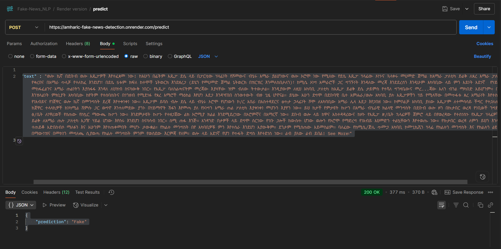

Here the API exposed using the system

You can locally run the code and get local apis.

I have also deployed the api to render.
SO you can access the api using the following link and rule.

1. API: https://amharic-fake-news-detection.onrender.com/

This helps us to check if the site working or not.
If it is working it will return

{
"message": "Hello, FastAPI"
}

If it is not working it will return something like this

{
"detail": "Method Not Allowed"
}

To test the models you can the following api and role

2. API: https://amharic-fake-news-detection.onrender.com/predict

Send this as the body of the request

{
"text" : "ወሎ ኬኛ በደቡብ ወሎ አዴፓዎች እየተፈጸመ ነው! ከአሁን በፊትም አዴፓ ደሴ ላይ በፓርቲው ሃላፊነት የሾመውና ብሄሩ አማራ ያልሆነውና ወሎ ኦሮሞ ነው የሚለው የደሴ አዴፓ ሃላፊው ኦነጉና ኋላቀሩ መሀመድ ጀማል ከአማራ ፓለቲካ ይልቅ ለጸረ አማራ ፓለቲካው በሚገባ የቀረበና በአማራ ጥላቻ የተለከፈ እንደሆነ፣ በደሴ 5ቱም ክፍለ ከተሞች ኔትወርክ እንደዘረጋ (ይሄን የመሀመድ ጀማል ኔትወርክ በዝርዝር እንመለስበታለን)፣ ከሚሴ ኦነግ አመራሮች ጋር ግንኙነት እንዳለው መረጃ እንደደረሰን እንዲሁም አካባቢው ላይ ምን አይነት አደገኛ የሃይማኖት መከፋፈልንና አማራ ጠልነትን እያስፋፋ እንዳለ ለህዝብ ስናሳውቅ ነበር፡፡ የአዴፓ ባለስልጣናትም መረጃው እያላቸው ዝም ብለው ትተውታል፡፡ እንዲያውም ለዚህ አካባቢ ፓለቲካ ከአዴፓ ይልቅ ደሴ ታይምስ የተሻለ ግንዛቤውና መረ...ጃው አለን ብንል ማካበድ አይሆንም፡፡ በአዴፓ እንዝላልነት ምክኒያት አካባቢው ከየትም የተሰባሰቡና በገንዘብ የሚደገፉ የጸረ አማሮች ማዕከል እየሆነ አደጋ እንዳዣበበ ስንወተውት ብዙ ጊዜ ሆኖናል፡፡ ይሄው አሁን ደግሞ በደቡባዊ ቤተ አምሐራ/ወሎ አካባቢ ያሉ አዴፓዎችን ሃይ የሚላቸው በመጥፋቱ ጸረ አማራነት እየተስፋፋ የነአብይና የነጀዋር ወሎ ኬኛ በመንግስት ደረጃ እየተቀነቀነ ነው፡፡ አዴፓም ይባስ ብሎ ደሴ ላይ ብሄሩ ኦሮሞ የሆነውን ኮ/ር አበራ በአስተዳደርና ፀጥታ ኃላፊነት ሾሞ ለአካባቢው አማራ ሌላ አደጋ እየጋበዘ ነው። ኮምቦልቻ አካባቢ ያለው አዴፓም ለተመሳሳይ ችግር የተጋለጠና ከጀዋር ተላላኪዎች ከነካሚል ሸምሱ ጋር ወግኖ እንተለመደው ያንኑ በሃይማኖት ሽፋን እየመጣ ያለ የኦነግን አማራ ጠል ፖለቲካ እያቀነቀነ መሆኑን እያየን ነው። ይህ ከታች የምታዩት ኩፖን በአማራ ብሄራዊ ክልላዊ መንግስት በደቡብ ወሎ ዞን በኩታበር ወረዳ የገቢወች ንግድና ልማት ፅ/ቤት ለነዋሪወች የሰጠው የስኳር ማውጫ ኩፖን ነው። እንደምታዩት ኩፖኑ የተዘጋጀው ልክ ኦሮሚያ ክልል እንደሚደረገው በኦሮምኛና በአማርኛ ነው። ደቡብ ወሎ ላይ ከዋና አስተዳዳሪውና ከዞኑ የአዴፓ ጽ/ቤት ኋላፊዎች ጀምሮ ላይ በየወረዳው የተሰገሰጉ የአዴፓ ሃላፊዎች ከአማራ ይልቅ ለአማራ ጠሉ ፓለቲካ አጋዥ ሃይል ሆነው እየሰሩ እንደሆነ ስናሳሳብ ነበር፡፡ ሰሚ ጠፋ እንጅ፡፡ አንዳንድ ቦታዎች ላይ ደግሞ ሰርገው የገቡ ጋሎች ከውስጥ ሆነው ወሎን የኦሮሞ የማድረግ የነአብይ አህመድን ተልኳቸውን እየተወጡ ነው። የኩታበር ወረዳ ለምን ይህን እንዳደረገ ተጠይቆ አድበስብሶ ማለፉን እና አሁንም እየተጠቀመበት መሆኑ ታውቋል። የክልሉ መንግስት በየ አካባቢዎቹ ምን እየተሰራ እንደሆነ አያውቅም። ደንታም የሚሰጠው አይመስልም፡፡ ባለፈው የከሚሴ/ጅሌ ጥሙጋ አካባቢ ኮሙኒኬሺን ሃላፊ የክልሉን መንግስት እና የክልሉን ልዩ ሀይል በማውገዝና በመኮነን መግለጫ ሲያወጣ የክልሉ መንግስት ምንም የወሰደው እርምጃ የለም። ወሎ ላይ አደገኛ የሆነ የጥፋት ድግስ እየተደገሰ ነው። ልብ ያለው ልብ ይበል! See More፡"
}

If successful you will get `Fake` or `True` result.

{
"prediction": "Fake"
}

If not successful you will get something like:

{
"detail": "Method Not Allowed"
}

Example:

Here is the link to the jupter notebook code from colab

https://colab.research.google.com/drive/1mPrgJtOn8B6Q1IefBSUb4S8EehaBSdqm?usp=sharing
